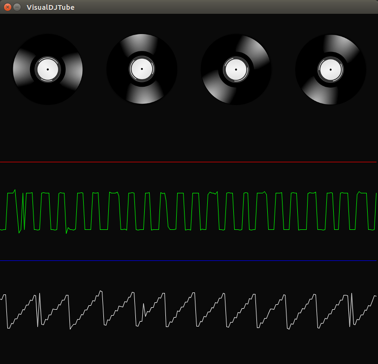

# VisualDJTube

This project is coursework associated with Coursera's
[Creative Programming for Digital Media & Mobile Apps](https://www.coursera.org/course/digitalmedia).
It is a simple application which plays up to four pure tones and visualizes
their wave forms. Click one of the records to see it in action.



## Running (Command Line)

You'll need to have a working copy of [Processing](https://processing.org/), a
programming language geared at visual arts. Download it and unzip; make note
of the `processing-java` command it contains.

Next, clone this repository into a folder named "VisualDJTube". From one
directory above (i.e. the parent of the "VisualDJTube" folder), execute:

```
/path/to/processing-java --sketch=VisualDJTube --run
```

## Running (IDE)
You'll need to have a working copy of [Processing](https://processing.org/), a
programming language geared at visual arts. Download it and unzip; open the
`processing` program it contains. This is Processing's IDE.

Next, clone this repository into a folder named "VisualDJTube". Then, through
Processing's UI, select "File > Open" and navigate to the "VisualDJTube.pde"
file. Once this is loaded, click the "Play" button.
```
